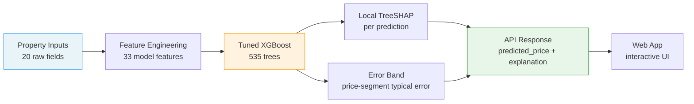
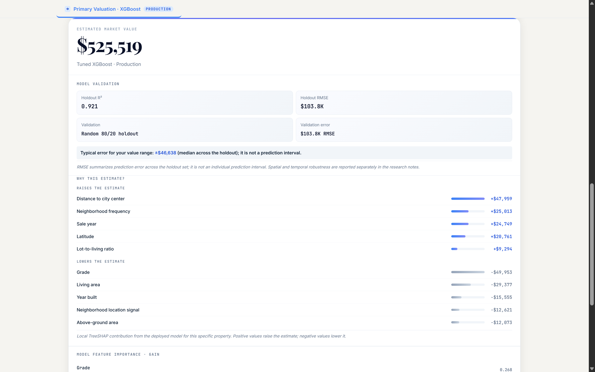
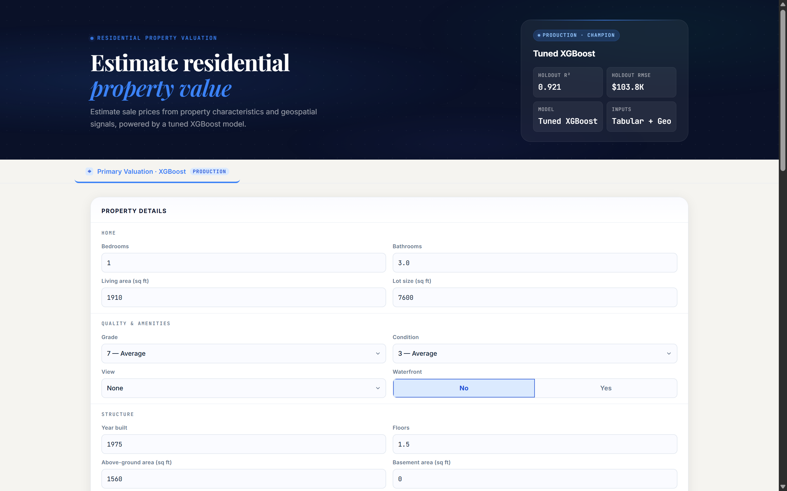

<h1 align="center">Residential Property Valuation</h1>

<p align="center">
  <em>Estimate residential sale prices from property characteristics and geospatial signals</em>
</p>

<p align="center">
  <a href="https://propertyvaluationbyhardik.vercel.app"></a>
  <a href="#quick-start"></a>
  <a href="#model-development"></a>
  <a href="#model-development"></a>
  <a href="#reproducibility"></a>
</p>

---

## At a glance

| Metric | Value |
|---|---|
| **Target** | Residential sale price (King County, WA — 2014–15 sales) |
| **Champion model** | Tuned XGBoost (535 trees, depth 4) |
| **Features** | 33 engineered tabular + geospatial |
| **Holdout R²** | 0.921 |
| **Holdout RMSE** | $103,803 |
| **Out-of-time R²** | 0.893 |
| **Spatial R²** | 0.809 |
| **Explainability** | Local TreeSHAP per prediction |
| **Deployment** | Node.js on Vercel — no Python at runtime |

---

## How it works



---

## What it does

King County residential sale prices (2014–2015) are predicted from 20 raw property attributes plus 13 engineered features — including geospatial signals (distance to city center, ZIP-frequency encoding, latitude-longitude interaction). The production model is a single tuned XGBoost regressor with local TreeSHAP explanations computed at request time. The app runs entirely on Vercel's Node.js runtime; no Python, no external model server, no database.

The same model also powers a command-line interface for batch inference and a Python FastAPI backend for local development.

---

## Data

- **Source**: King County, WA residential sales (2014–2015)
- **Training set**: 16,110 properties (after deduplication of 99 repeat-sale rows; most-recent transaction retained)
- **Test set**: 5,404 properties (no price column; used for submission only)
- **Overlap**: 70 property IDs appear in both train and test (same attributes; no label leakage since test carries no prices)
- **Image coverage**: 2,189 / 16,110 = 13.59% (convenience sample — not used in production)

### Feature engineering

The 20 raw fields are augmented to 33 model features:

| Feature | Type | Derivation |
|---|---|---|
| `age` | Derived | `SALE_REFERENCE_YEAR - yr_built` (ref = 2015) |
| `renovated` | Binary | 1 if `yr_renovated > 0` |
| `renovation_age` | Derived | `SALE_REFERENCE_YEAR - yr_renovated` if renovated, else 0 |
| `total_sqft` | Derived | `sqft_above + sqft_basement` |
| `basement_frac` | Derived | `sqft_basement / total_sqft` |
| `above_frac` | Derived | `sqft_above / total_sqft` |
| `living_per_bedroom` | Derived | `sqft_living / max(bedrooms, 1)` |
| `lot_living_ratio` | Derived | `sqft_lot / sqft_living` |
| `has_basement` | Binary | 1 if `sqft_basement > 0` |
| `has_view` | Binary | 1 if `view > 0` |
| `lat_long_interaction` | Derived | `lat * long` |
| `dist_to_center_km` | Geospatial | Haversine distance to `(47.6062, -122.3321)` |
| `zip_freq` | Frequency | Fraction of training rows in each ZIP code |
| `zip_target` | Target-encoded | James-Stein shrinkage with smoothing=20; fold-safe (fitted on training split only, inside sklearn Pipeline) |

---

## Model development

### Tuning

- **Method**: RandomizedSearchCV — 30 iterations × 3-fold CV (`RANDOM_STATE=42`)
- **Selection**: Temporal-generalization tie-break within 1% of random-holdout RMSE
- **Champion params**: `learning_rate=0.087`, `max_depth=4`, `n_estimators=535`, `colsample_bytree=0.782`, `min_child_weight=5`, `reg_lambda=3.421`, `subsample=0.776`

### Model comparison

All models use the same 33 engineered features and the same 80/20 property-ID holdout.

| Model | RMSE | MAE | R² | Notes |
|---|---|---|---|---|
| **XGBoost (tuned)** | **103,803** | **61,172** | **0.9205** | **Champion — best generalization** |
| CatBoost (tuned) | 102,801 | 61,584 | 0.9221 | Higher R² on random holdout, weaker out-of-time and spatial |
| LightGBM | 111,882 | 62,944 | 0.9077 | — |
| Stacked blend (Ridge) | 101,637 | 60,905 | 0.9238 | Weights: XGB 0.18 / Cat 0.63 / LGBM 0.22 |
| Random Forest (tuned) | 118,910 | 66,237 | 0.8957 | — |

> **Why XGBoost and not the stack or CatBoost?** The stacked blend and CatBoost scored marginally better on the random holdout but degraded decisively on temporal and spatial generalization (CatBoost out-of-time R² 0.881 vs XGBoost 0.893; spatial R² 0.598 vs 0.809). The champion was selected for robustness, not leaderboard score.

---

## Validation and generalization

Same tuned XGBoost, same 33 features — only the split strategy changes.

| Leg | Train | Val | RMSE | R² | ΔR² vs random | What it tests |
|---|---|---|---|---|---|---|
| **Random 80/20** | 12,888 | 3,222 | 103,803 | 0.9205 | — | In-distribution accuracy |
| **Temporal (out-of-time)** | 12,554 | 3,556 | 117,474 | 0.8926 | −0.028 | Forward generalization (cutoff 2015-03-01) |
| **Spatial** | 15,656 | 454 | 95,433 | 0.809 | −0.112 | Geographic generalization (median nn = 0.094 km; 99.6% of val within 1 km of training) |

The spatial gap (−0.112 R²) is the most informative: it isolates how well the model extrapolates to neighborhoods it has not seen at the exact same locations. The temporal gap (−0.028) is small, confirming the model does not overfit to the 2014–2015 market window.

---

## Explainability

Every prediction ships with a **local TreeSHAP** explanation computed at request time — no external SHAP library, no precomputed cache. The XGBoost native `pred_contribs=True` API is used directly.

**Global feature importance** (mean |TreeSHAP|, n=300):

| Rank | Feature | Mean |SHAP|| |
|---|---|---|
| 1 | `zip_target` | $78,038 |
| 2 | `grade` | $62,199 |
| 3 | `sqft_living` | $50,940 |
| 4 | `dist_to_center_km` | $48,244 |
| 5 | `lat` | $26,807 |
| 6 | `view` | $15,931 |
| 7 | `lat_long_interaction` | $15,330 |
| 8 | `sqft_living15` | $15,002 |
| 9 | `sqft_above` | $14,779 |
| 10 | `condition` | $12,631 |

> These are global training-set importances displayed in the UI for context. The per-property explanations shown in the app are computed live from the deployed model and are specific to each input.

### Deployed local explanation

The API response includes:

- `local_shap.expected_value` — SHAP base value ($538,904.63)
- `local_shap.total_contribution` — sum of all feature contributions for this property
- `local_shap.predicted_price` — `expected_value + total_contribution`, rounded to cents
- `local_shap.top_positive` / `top_negative` — up to 5 features raising/lowering the estimate
- `error_band` — typical error for the price segment containing the prediction

**Canonical example** (3 bed / 2 bath / 1,910 sqft / 1975 / ZIP 98065):

| Field | Value |
|---|---|
| Predicted price | $557,597.38 |
| SHAP base (expected value) | $538,904.63 |
| Total contribution | +$18,692.50 |
| Top positive factor | `dist_to_center_km` (+$61,560) |
| Top negative factor | `grade` (−$50,573) |
| Error band | $512K–$686K (typical error $46,638; n=644) |

---

## Error analysis

### By price band

| Band | n | Mean price | RMSE | MAE | Median rel. error | Mean bias |
|---|---|---|---|---|---|---|
| Low (< $320K) | 807 | $254,898 | $54,703 | $36,511 | 9.8% | +$16,831 |
| Mid ($320K–$450K) | 804 | $383,343 | $56,439 | $41,506 | 8.2% | +$9,877 |
| High ($450K–$680K) | 805 | $530,781 | $70,762 | $52,107 | 7.4% | +$1,962 |
| Luxury (> $680K) | 806 | $989,746 | $178,602 | $114,536 | 8.4% | −$30,171 |

### Waterfront

| Type | n | MAE | Mean bias | Mean price |
|---|---|---|---|---|
| Non-waterfront | 3,201 | $60,198 | +$436 | $529,580 |
| Waterfront | 21 | $209,686 | −$124,356 | $2,082,738 |

> Waterfront properties (n=21) are systematically underpredicted. The model sees too few waterfront examples to learn their premium reliably.

---

## Research: satellite imagery

A parallel research track tested whether satellite imagery could improve the tabular model. The short answer is **no** — under the tested setup, imagery degraded performance.

| Experiment | RMSE | R² | ΔR² vs tabular control |
|---|---|---|---|
| Tabular control (image subset) | 103,970 | 0.9203 | — |
| DINOv2 fusion | 109,424 | 0.9117 | −0.009 |
| E5 multimodal (frozen) | — | 0.845 | −0.075 |
| E5B + RN50 (frozen) | — | 0.828 | −0.092 |
| PCA on DINOv2 embeddings | — | ≤0.863 | −0.057 |
| Image-only (no tabular) | — | ~0.14 | — |

**Image coverage**: 13.59% of training properties (2,189 / 16,110). Coverage bias analysis found negligible differences across all measured attributes (all |Cohen's d| < 0.15).

> The vision branch is archived as research documentation and is intentionally not exposed in the production app or CLI.

---

## Production app

The deployed app at [propertyvaluationbyhardik.vercel.app](https://propertyvaluationbyhardik.vercel.app) works in five steps:

1. **User enters property details** — bedrooms, bathrooms, sqft, year built, ZIP, coordinates, grade, condition, view, waterfront
2. **Frontend sends `POST /api/predict`** — JSON payload with 20 raw fields
3. **Node.js handler loads the request** — parses the body, validates ranges
4. **`node/scorer.js` runs inference** — feature engineering → XGBoost float32 walk → local TreeSHAP → error band lookup
5. **Response rendered** — estimated price, validation stats, top factors raising/lowering the estimate

### Key design decisions

- **No Python at runtime**: The production path is pure Node.js. Python remains for local development, training, and research only.
- **No external model server**: XGBoost model weights are loaded from three JSON files (`tabular_model.json`, `tabular_pipeline.json`, `tabular_meta.json`) bundled with the Node function.
- **500 MB function limit**: The Node.js deployment avoids the 500 MB Python runtime limit on Vercel's serverless functions.
- **Bit-exact parity**: Node.js inference matches the Python oracle to within measurement noise (501-case golden set, max absolute error = 0 on prediction, contribution, and base value).

---

## API reference

### `POST /api/predict`

**Request**:

```json
{
  "bedrooms": 3,
  "bathrooms": 2.0,
  "sqft_living": 1910,
  "sqft_lot": 7600,
  "floors": 1.5,
  "waterfront": 0,
  "view": 0,
  "condition": 3,
  "grade": 7,
  "sqft_above": 1560,
  "sqft_basement": 0,
  "yr_built": 1975,
  "yr_renovated": 0,
  "zipcode": 98065,
  "lat": 47.5724,
  "long": -122.23,
  "sqft_living15": 1840,
  "sqft_lot15": 7620,
  "sale_year": 2015,
  "sale_quarter": 3
}
```

**Response** (200):

```json
{
  "predicted_price": 557597.38,
  "model": "XGBoost tuned (tabular + engineered features)",
  "model_role": "primary",
  "status": "production",
  "local_shap": {
    "expected_value": 538904.63,
    "total_contribution": 18692.5,
    "predicted_price": 557597.12,
    "top_positive": [
      {"feature": "dist_to_center_km", "contribution": 61560.12, "label": "Distance to city center"}
    ],
    "top_negative": [
      {"feature": "grade", "contribution": -50572.52, "label": "Construction grade"}
    ],
    "method": "TreeSHAP on the deployed model, evaluated at request time"
  },
  "error_band": {
    "segment_label": "$512K–$686K",
    "typical_error": 46637.89,
    "n": 644,
    "method": "median absolute error within the predicted-price decile segment",
    "note": "RMSE summarizes prediction error across the holdout set; it is not an individual prediction interval."
  }
}
```

**Error responses**:

| Status | Condition |
|---|---|
| 404 | Route not found (e.g. `GET /api/predict`) |
| 422 | Invalid input (missing required field, value out of range) |
| 500 | Internal error |

### `GET /api/health`

Returns `{"status": "ok", "model": "XGBoost tuned tabular"}`.

---

## Frontend

The single-page UI at the root path (`/`) is a static HTML file (`public/index.html`, 60 KB) with no build step, no framework, and no embedded API keys. The only network call is `fetch('/api/predict')`.

The UI displays:

- Property input form (20 fields with validation)
- Estimated market value
- Model validation stats (holdout R², RMSE)
- Typical error for the predicted price range
- Top factors raising/lowering the estimate (local TreeSHAP)
- Model feature importance (global, gain-based)

<p align="center">
  
  &nbsp;&nbsp;
  
</p>

---

## Deployment architecture

```
┌─────────────────────────────────────────────────────────────────┐
│  Vercel (propertyvaluationbyhardik.vercel.app)                  │
│                                                                 │
│  ┌──────────────┐  ┌──────────────┐  ┌────────────────────┐    │
│  │ public/      │  │ api/health.js│  │ api/predict.js     │    │
│  │ index.html   │  │ GET 200      │  │ POST → inference   │    │
│  │ (static)     │  │              │  │                    │    │
│  └──────────────┘  └──────────────┘  └────────┬───────────┘    │
│                                                │                │
│                                    ┌───────────▼───────────┐    │
│                                    │ node/scorer.js        │    │
│                                    │ feature engineering   │    │
│                                    │ XGBoost float32 walk  │    │
│                                    │ TreeSHAP (native)     │    │
│                                    │ error band lookup     │    │
│                                    └───────────┬───────────┘    │
│                                                │                │
│                              ┌─────────────────┼─────────┐      │
│                              │ tabular_model.json        │      │
│                              │ tabular_pipeline.json     │      │
│                              │ tabular_meta.json         │      │
│                              └───────────────────────────┘      │
└─────────────────────────────────────────────────────────────────┘
```

- **Routing**: `vercel.json` maps `/api/predict` and `/api/health` to Node.js functions; `/` to `public/index.html`; `/health` rewrites to `/api/health`.
- **Model files**: Three JSON artifacts (model weights, feature pipeline, metadata) are bundled with the Node function via `includeFiles`.
- **Protection**: Vercel Deployment Protection is disabled (was enabled by default; turned off via REST API to allow unauthenticated public access).
- **Auto-deploy**: Git-linked to `gautamhardik/residential-property-valuation`; pushes to `main` trigger automatic deployments.

---

## Reproducibility

### Research vs production

| Concern | Research (Python) | Production (Node.js) |
|---|---|---|
| Model training | `scripts/` + `src/models/` | Not applicable (pre-trained) |
| Inference | `app/backend/main.py` (FastAPI) | `node/scorer.js` + `api/predict.js` |
| Explainability | `shap` library (research plots) | XGBoost native `pred_contribs` (no `shap` package) |
| Feature engineering | `src/features/build_features.py` | Embedded in `node/scorer.js` |
| Dependencies | `requirements-research.txt` | `package.json` (Node ≥ 20) |

### Local development

```bash
# Install Python deps (for research / local API)
make install          # or: pip install -r requirements.txt

# Run tests
make test             # or: pytest -q

# Smoke-test the API
make smoke            # or: python scripts/smoke_api.py

# Start the local API
make run-api          # or: python app/run.py --reload

# CLI inference
make run-cli          # or: python -m app.cli --bedrooms 3 --bathrooms 2.0 ...
```

### Node parity tests

```bash
npm install           # install Node deps
node node/test_prediction.js   # prediction parity (501 cases)
node node/test_shap.js         # SHAP parity
node node/test_contract.js     # API contract tests
node node/parity.js            # full parity suite
```

---

## Quick start

```bash
# Clone
git clone https://github.com/gautamhardik/residential-property-valuation.git
cd residential-property-valuation

# Option A — Python local API
pip install -r requirements.txt
python app/run.py
# Open http://127.0.0.1:8000

# Option B — Node parity tests
npm install
node node/parity.js
```

---

## Demo video

<video controls src="docs/demo.mp4" width="100%">
  Your browser does not support the video tag.
  <a href="docs/demo.mp4">Download the demo video</a>.
</video>

---

## Repository structure

```
├── api/                    # Vercel serverless functions
│   ├── predict.js          # POST /api/predict handler
│   └── health.js           # GET /api/health handler
├── app/
│   ├── backend/main.py     # Python FastAPI (local dev)
│   ├── frontend/index.html # Production UI (60 KB)
│   ├── cli.py              # CLI inference
│   └── run.py              # Local API launcher
├── docs/
│   └── demo.mp4            # Demo video
├── images/
│   └── screenshots/        # App screenshots
├── models/deployed/        # Production artifacts
│   ├── tabular_model.json  # XGBoost weights
│   ├── tabular_pipeline.json # Feature pipeline
│   └── tabular_meta.json   # Metadata
├── node/
│   ├── scorer.js           # Node.js inference engine
│   ├── parity.js           # Full parity suite
│   ├── test_*.js           # Parity + contract tests
│   └── ...
├── reports/
│   ├── figures/            # Analysis plots
│   ├── node_scorer/        # Parity report + golden set
│   └── *.json              # Metrics, audits, experiments
├── src/
│   ├── features/build_features.py  # Feature engineering
│   ├── config.py           # Constants, paths, seeds
│   └── inference/          # Python inference (local)
├── tests/test_core.py      # 29 unit + integration tests
├── vercel.json             # Routing + build config
├── package.json            # Node deps
├── Makefile                # install/test/smoke/run
└── requirements.txt        # Python runtime deps
```

---

## Limitations

- **Waterfront**: Only 21 waterfront properties in the validation set; predictions for waterfront homes should be treated as approximate.
- **Luxury segment**: RMSE of $178,602 and mean bias of −$30,171 for homes above $680K — the model systematically underpredicts the most expensive properties.
- **Image coverage**: Only 13.59% of training properties had satellite imagery available; the vision research track concluded that imagery did not improve performance under the tested setup.
- **Temporal window**: Trained on 2014–2015 sales; extrapolation to significantly different market conditions has not been validated.
- **Geographic scope**: King County, WA only. The model has not been tested on other markets.

---

## License

See repository for license details.
