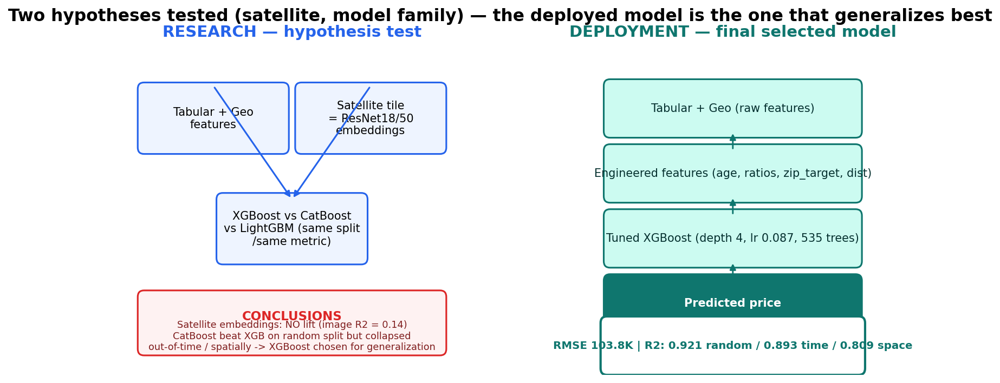
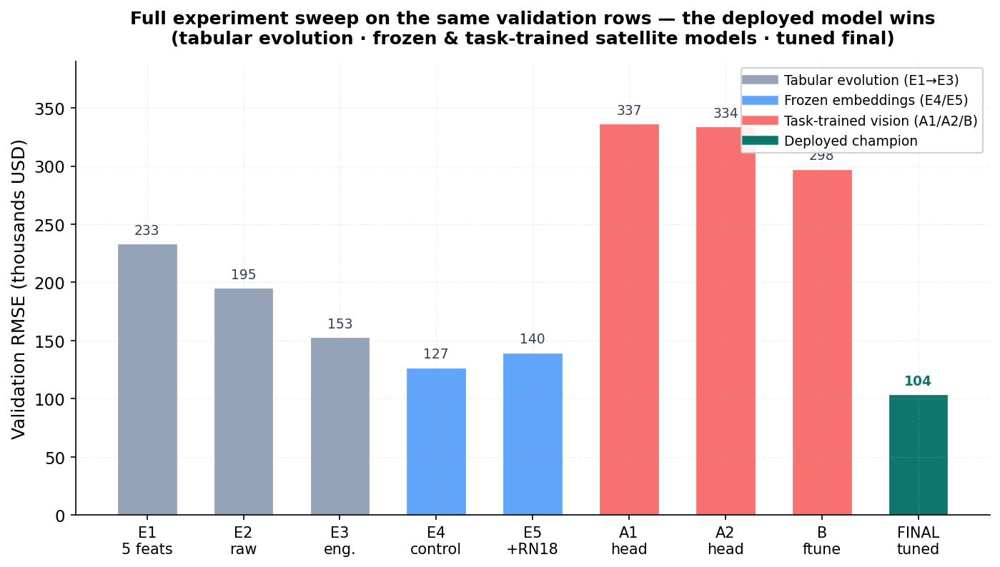
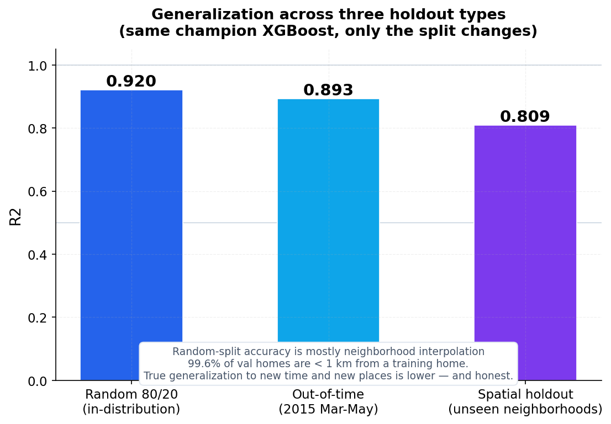

# Property Valuation with Satellite Imagery Analysis

**An end-to-end data science study testing whether satellite imagery adds predictive signal to
residential property valuation.**

| | |
|---|---|
| **Best production model** | Tuned XGBoost |
| **RMSE** | \$103.8K |
| **R²** | 0.921 |
| **Key finding** | Frozen *and* task-trained ResNet18 experiments failed to provide competitive visual signal, so XGBoost remained the production champion. |

**Quick answers**

- **What?** A property-valuation system for King County, WA plus a satellite-imagery research branch.
- **Why?** To test whether satellite imagery adds predictive information beyond
  housing/geospatial features.
- **What worked?** Engineered tabular + geospatial features → tuned XGBoost (RMSE \$103.8K, R² 0.921).
- **What didn't?** Frozen embeddings and task-trained ResNet18 visual models (best R² 0.296 vs the
  tabular control 0.872 on the same validation rows).
- **What is deployed?** XGBoost as the only production inference path. The satellite / ResNet18 work
  remains documented as research only and is not exposed through the production app.

---

## Authoritative artifacts

The project keeps one canonical file per final deliverable in `reports/ARTIFACT_GUIDE.md`.
Use that guide when you want the exact final model, metrics, split validation, SHAP, error analysis,
satellite research result, submission, or report.

---

## Results at a Glance




| Experiment | Model | Input | RMSE | R² |
|---|---|---|---|---|
| E1 — original 5 features | Linear Regression | 5 tabular features | \$233.4K | 0.598 |
| E2 — full raw tabular | XGBoost | 21 raw features | \$115.1K | 0.902 |
| E3 — engineered tabular | XGBoost | engineered tabular + geo | \$110.6K | 0.910 |
| E4 — image-subset control | XGBoost | tabular on image-covered subset | \$126.8K | 0.872 |
| E5 — satellite added | XGBoost | tabular + ResNet18 embeddings | \$139.8K | 0.844 |
| E5B — satellite added (ResNet50) | XGBoost | tabular + ResNet50 embeddings | \$147.0K | 0.828 |
| A1 — trained head (price MSE) | ResNet18 | image, trainable regression head | \$336.6K | 0.099 |
| A2 — trained head (log-price) | ResNet18 | image, trainable regression head | \$334.0K | 0.113 |
| B — partial fine-tune (layer4) | ResNet18 | image, fine-tuned layer4 + head | \$297.5K | 0.296 |
| E6 — DINOv2 fusion (executed check) | XGBoost | tabular + DINOv2-vits14 embeddings | \$109.4K | 0.912 |
| **FINAL — tuned** | **XGBoost** | **engineered tabular + geo** | **\$103.8K** | **0.921** |

Every number above is read directly from committed artifacts
(`reports/results_tabular.csv`, `reports/results_multimodal.csv`, `reports/results_dinov2_fusion.json`,
`reports/tuned_best.json`) — no manual re-entry.

Population caveat: E1–E3 use the random 80/20 holdout (n=3,222); E6 uses the same full-population
split (its own 0.9203 tabular control); A1/A2/B and E4/E5 use the 434 image-covered properties. Do
not compare across populations directly.

---

## Generalization — three holdouts, one honest number

Same champion XGBoost, same engineered features, **only the split changes** — so the gaps isolate
the effect of how far the model must extrapolate:

| Holdout | What it tests | R² |
|---|---|---|
| Random 80/20 | in-distribution interpolation (99.6% of val homes < 1 km from train) | **0.921** |
| Out-of-time (2015 Mar–May) | predicting into the future | **0.893** |
| Spatial (unseen KMeans neighborhoods) | predicting entire new neighborhoods | **0.809** |

The honest headline: the model is excellent at interpolation, still strong a quarter into the future,
and noticeably weaker when a whole neighborhood must be closed entirely. Quote the **0.809** (or 0.893)
for any out-of-sample claim, never just the random-split 0.921. Full details:
`reports/split_strategy.json` and `reports/temporal_validation.json`.



**Reading the spatial number honestly.** The spatial-holdout RMSE is *lower in absolute terms* than
the random-split value only because that small holdout (n=454, ~2 KMeans cells) covers a lower-variance
price region. **R² is the more informative robustness comparison**, and it is the value quoted
everywhere in this README.

---

## Model space was broadened — the champion was chosen for generalization

We did not stop at one algorithm. On the same split we tuned and compared three families plus a
leak-free OOF-Ridge stack:

| Model | Random-holdout RMSE | R² |
|---|---|---|
| Tuned XGBoost (champion) | **$103.8K** | 0.9205 |
| Tuned CatBoost | $103.6K | 0.9209 |
| LightGBM | $111.9K | 0.9077 |
| OOF-Ridge stack (all three) | $101.6K | 0.9238 |

**The surprise:** CatBoost and the stack beat XGBoost on the *in-distribution random holdout*, but
that advantage evaporated the moment the model had to generalize — CatBoost's out-of-time R² was 0.881
(vs XGBoost 0.893) and its spatial R² collapsed to **0.598** (vs XGBoost 0.809). CatBoost was
over-exploiting the target-encoded ZIP signal. Because our selection is **generalization-aware**
(temporal tie-break), XGBoost was kept as champion. Full details: `reports/results_ensemble.csv`,
`reports/experiment_log.json`.

---

## What happened when we added satellite imagery?

This is the project's central experiment, so it deserves its own section.

1. **Coverage was limited.** Only **13.6%** of properties (2,189/16,110) had a usable Mapbox
   `satellite-v9` 256 px tile (zoom 18). Tiles are keyed by property id; content-validated; cached.
2. **Coverage was "attribute-neutral".** A dedicated analysis (`reports/coverage_bias.json`) compares
   covered vs non-covered properties on price, grade, size, coordinates and waterfront: **all |Cohen's
   d| < 0.15** (price d = −0.008, grade d = −0.039). The 13.6% is a convenience sample, but it is not
   skewed on observable attributes — so the experiment below is not confounded by a biased image sample.
3. **Frozen ImageNet encoders.** ResNet18 (512-d) and ResNet50 (2048-d), ImageNet-pretrained, frozen,
   mean-pooled, extracted in `.eval()` under `no_grad` — *no* visual fine-tuning.
4. **Fair comparison.** Image-only and tabular+embedding models were evaluated on the **same
   image-covered subset**, the **same canonical split**, the **same metric**, and — for XGBoost — the
   **exact tuned configuration** used by the final model.
5. **Result.** Image-only models are near-useless (R² ≈ 0.14); adding embeddings to the tuned tabular
   model **degrades** it (R² 0.872 → 0.844 / 0.828).
6. **Decision.** The deployed model therefore remains the tabular/geospatial XGBoost. The satellite
   premise was tested and, on this setup, rejected — explicitly and reproducibly.

**Scoped conclusion:** *Frozen ImageNet-derived ResNet18/50 satellite embeddings did not provide
incremental predictive value over the tabular/geospatial baseline under the evaluated dataset and
experimental setup.* This is a statement about this representation and dataset, not about "satellite
imagery" in general.

### What about fine-tuning? (the DL extension)

The natural counter-argument is that frozen ImageNet features are the wrong representation and that
*task-specific training* would recover visual signal. We ran exactly that experiment and stopped
early:

- **A1/A2 — trainable regression head** on a frozen ResNet18 (image-only): R² 0.099 / 0.113. Training
  the head does not create visual signal that isn't already in the frozen features.
- **B — partial fine-tune of layer4** + head (same split, early stopping, seed 42): R² 0.296. Fine-
  tuning narrows the gap but remains far below the tabular control (0.872) on the *same* 434 image-
  covered validation rows.
- **Decision gate → Case 1 (STOP).** Because the trained visual signal (0.113 → 0.296) still
  trails the tabular control by >0.57 R², the pre-registered gate stopped the planned
  task-trained-embedding fusion (E6), ViT, full ResNet50 fine-tune, and TTA. Two additional
  representation checks that **were** executed and committed also came back negative:
  an E6 fusion with DINOv2-vits14 embeddings (R² 0.9117 vs 0.9203 tabular on the same covered
  split) and PCA-ablated embeddings (best tabular variant 0.8634 vs 0.8721 control). None of
  them beat the tabular champion, so the negative result holds across representations.
  Full details: `reports/results_dinov2_fusion.json`, `reports/results_multimodal_pca.csv`.

The vision branch remains **archived as research documentation** and is deliberately excluded from the
production app. It is not exposed in the API or UI, and it is not the production champion. Grad-CAM
and the image experiments remain in the repository as historical evidence for the negative result.
Full details: `reports/project_report.md` §11 and `reports/results_dl_final.json`.

---

## Research vs. deployment — keep them separate

```
RESEARCH (historical hypothesis test)      FINAL DEPLOYMENT (selected model)
───────────────────────────────────────   ──────────────────────────────────

 Tabular ───────────────────────────────┐   Tabular + Geo
                                       │      ↓
 Satellite → ResNet experiments ───────┼──> Engineered Features
                                       │      ↓
         compare on same split          │   Tuned XGBoost
                                       │      ↓
            embeddings do not help     │   Predicted Price
```

The FastAPI service, CLI and demo UI serve the **tabular model** as the production default. Satellite
imagery was evaluated as a research question, did not improve the validated model, and is therefore
kept as a documented historical branch rather than a deployed feature. The vision experiments remain
in the repository for transparency and reproducibility, but they are not presented to end users as part
of the live product.

---

## Portfolio / resume-ready summary

For a data-science resume, the project story is:

- Built a full property-valuation pipeline from raw housing + geospatial data to a production-ready
 XGBoost regressor with feature engineering and evaluation.
- Ran a controlled multimodal experiment to test whether satellite imagery adds value beyond the
 tabular baseline, and documented the result honestly: it did not.
- Selected the champion using a generalization-aware decision rule — not a random-split leaderboard —
 which is a strong sign of judgment and ML rigor.
- Kept the tabular model as the production service while archiving the image branch as research-only
 documentation, showing product discipline as well as scientific caution.

This is a stronger story than simply saying "I built a vision app" because it demonstrates model
selection rigor, robustness checks, and clear deployment boundaries.

---

## Key findings

- **XGBoost was the strongest model**, reaching RMSE \$103.8K / R² 0.921 on the random holdout (tuned
  via `RandomizedSearchCV`, 30 iterations, 3-fold CV, fold-safe target encoding). It was kept as
  champion precisely because it *generalized* best (temporal R² 0.893, spatial R² 0.809), not because
  it won the random holdout.
- **Broadening the model space found a better in-distribution model (CatBoost, stack)** — but they
  overfit the ZIP target-encoding and collapsed out-of-time/spatially. The experiment, not the
  leaderboard, chose the deployed model.
- **Satellite embeddings did not improve prediction** under the tested frozen-ResNet setup — image-only
  R² ≈ 0.14, and adding embeddings hurt the strong tabular control.
- **Generalization is weaker than random-split performance**, so the headline 0.921 should never be
  quoted as out-of-sample accuracy; use 0.893 (time) or 0.809 (space).
- **ZIP/geographic information is highly predictive.** Global SHAP importance is led by the encoded
  ZIP price signal, then `grade` and `sqft_living`:
  `reports/figures/fig_shap_importance.png`. For the evaluated vision model, Grad-CAM shows *which
  image regions are associated with its price prediction* — a description, not a causal claim:
  `reports/figures/fig_gradcam.png`.

**Business framing.** An R² of 0.92 in raw terms is abstract; what practitioners care about is where
the dollars of error are. Errors concentrate non-uniformly:
- **Luxury homes** dominate absolute error (RMSE \$178.6K, median relative error ≈ 8%). Underpredicted
  on average (bias −\$30.2K) — a real tail-risk disclosure.
- **Waterfront** (21 observations) is the hardest segment (MAE \$210K, bias −\$124K) — too few samples
  to learn.
- **Cheap homes** are overpredicted (Low-band bias +\$16.8K) — the model won't let prices fall far
  enough.
- Typical (median) **relative error is ≈ 8%** overall — i.e. a \$500K home is usually priced within
  ~\$40K. Full table: `reports/error_analysis.json`.

---

## Why this project matters

This is more than house-price prediction. It is a complete research loop:
**hypothesis → controlled experiment → honest negative result → investigation of why (coverage bias,
representation) → model selection → deployment.** Negative results, run fairly, are rarer and more
valuable than another tuned leaderboard. The repository shows exactly what was tried, why, and what
the evidence says — not a demo bolted around an interesting-sounding idea.

---

## Project structure

```
app/                 lightweight deployment (FastAPI backend + HTML demo + CLI)
data/                raw train/test xlsx (large; not committed)
archive/             historical research notes and provenance
INTERVIEW_PREP.md    interview-ready summary of the main claims
notebooks/           clean narrative notebooks + legacy history
PACKAGE.md           package / structure guide
predictions/         final submission.csv (5,404 rows)
preprocessed/        satellite manifest, embeddings, deterministic train/val split
reports/             phase artifacts, ARTIFACT_GUIDE.md, and full project report
scripts/             phase scripts, one per step (seeded, idempotent); scripts/legacy/ = superseded
src/                 importable package (data, features, models, satellite, evaluation, inference)
```

---

## Quick start

```bash
python -m venv .venv && .venv\Scripts\activate   # macOS/Linux: source .venv/bin/activate
pip install -r requirements.txt
```

Run the project checks:

```bash
pytest -q
make test
```

Build the API in Docker:

```bash
docker build -t satellite-property-valuation .
docker run --rm -p 8000:8000 satellite-property-valuation
```

Run the full pipeline (each script is seeded & idempotent):

```bash
python scripts/data_audit.py            # data validation
python scripts/tabular_baselines.py     # E1/E2/E3 baselines
python scripts/split_validation.py      # controlled random vs spatial robustness
python scripts/temporal_validation.py   # out-of-time (2015 Mar-May) robustness
python scripts/tune_models.py           # fold-safe tuning + generalization-aware champion
python scripts/ensemble_experiment.py   # broader model space + OOF-Ridge stack
python scripts/satellite_coverage.py    # image manifest + coverage
python scripts/coverage_bias.py         # covered vs non-covered distribution comparison
python scripts/extract_embeddings.py    # ResNet18/50 embeddings (cached in preprocessed/)
python scripts/multimodal_experiment.py # fair E4/E5 comparison
python scripts/final_model.py           # retrain on full train -> submission + artifacts
python scripts/error_analysis.py        # segment-level error report
python scripts/shap_analysis.py         # global SHAP importance
python scripts/phase1_manifest.py       # canonical 1,755/434 vision split + manifest
python scripts/phase2_experiment_a.py   # Experiment A (trained head) + B (layer4 fine-tune)
python scripts/phase3_4_eval_gate.py    # fair E4/E5/A1/A2 eval + decision gate
python scripts/phase8_serialize.py        # full-model TorchScript + serialization verify
python scripts/phase12_gradcam.py       # Grad-CAM from the actual evaluated model
python scripts/phase13_14_final_table.py  # authoritative final table + conclusion
python scripts/make_figures.py          # the polished report figures
python scripts/smoke_api.py             # FastAPI smoke test
```

Infer a price with the deployed model:

```bash
# Preferred startup: automatically finds a free local port if 8000 is already in use
python app/run.py
# optional: PORT=8001 python app/run.py
# optional: python app/run.py --reload

# Demo UI will open on the selected local port, e.g. http://127.0.0.1:8000
python -m app.cli --bedrooms 3 --bathrooms 2.0 --sqft_living 1910 --sqft_lot 7600 \
    --floors 1.5 --sqft_above 1560 --yr_built 1975 --zipcode 98065 \
    --lat 47.5724 --long -122.2300 --sqft_living15 1840 --sqft_lot15 7620
```

The satellite / ResNet18 experiments are archived as research only — they are not callable
from the app or the CLI. See the satellite sections below for the research conclusion.

```python
from src.inference.predict import predict_single
predict_single({"bedrooms": 3, "bathrooms": 2.0, "sqft_living": 1910, ...})
# -> {"predicted_price": ..., "importance_type": "xgboost_gain", "top_factors_gain": [...]}
```

## Deploy to Vercel

A single Vercel deployment serves both the static frontend and the FastAPI backend:

- `api/index.py` exposes the existing app under `/api/*` (e.g. `/api/predict`, `/api/health`);
  `vercel.json` routes `/`, `/predict`, and `/health` into the same function.
- `requirements.txt` is runtime-only; research/training deps live in `requirements-research.txt`
  (never deployed).
- `.vercelignore` keeps research artifacts (datasets, imagery, embeddings, vision checkpoints,
  notebooks, tests, figures) out of the serverless bundle so the lambda stays ~1 MB.
- No database, no secrets, no environment variables are required by production inference.
- Local development already mirrors the deployed wiring: `python app/run.py` launches
  `api.index:app`, so the same `/api/*` paths are used locally and in production.

Run the same-origin integration locally, then push to Vercel (builds `api/index.py` automatically):

```bash
python app/run.py                      # local dev (same /api/* paths as prod)
# vercel --prod                        # after: Vercel CLI deploy
```

---

## Limitations & future work

- **Scope:** King County 2014–2015 sales only; no claim of geographic or temporal generality. We now
  *quantify* both gaps (temporal R² 0.893, spatial R² 0.809) rather than assume them away.
- **Satellite:** 13.6% convenience-sampled coverage; single source/resolution (Mapbox, 256 px,
  zoom 18); task-trained visual models tested (head-only and layer4 partial fine-tune) and rejected
  by the pre-registered gate; central business district proxy rather than true CBD polygon.
- **Evaluation:** the random-split headline reflects local interpolation; quote the out-of-time
  (R² 0.893) or spatial-holdout (R² 0.809) for any out-of-sample claim.
- **Business:** a sale price is not intrinsic value; predictions are point estimates, not appraisals.

**Future work (explicitly not unfinished requirements):** higher-resolution or multi-angle/multi-
temporal imagery, a remote-sensing-specific representation, larger/carefully-sampled coverage,
geographically broader validation. These would change the *satellite* branch of the research — they
do not change the deployed tabular model.

---

## Reproducibility & integrity notes

- **Leakage:** `zip_target` (smoothed ZIP target-encoding, λ=20) is fitted on the training split only
  in every experiment, including fold-safe within tuning CV; validation/test prices never enter any
  encoding. Full audit: `reports/project_report.md` §5.
- **Champion is deterministic & recorded:** the tuned config + model family live in
  `reports/tuned_best.json`; every downstream phase loads it through one factory so nothing drifts.
  `reports/experiment_log.json` records each phase's artifact and rationale.
- **Reproduction:** committing the satellite embeddings + split lets the multimodal phase re-run
  offline; only the raw `data/*.xlsx` must be supplied.
- **Submission:** `predictions/submission.csv` is a 1:1 mirror of `data/test.xlsx` (5,404 rows, 0 nulls,
  id multiset identical, including the 8 legitimate repeat-sale ids in the test file).

Full write-up: [`reports/project_report.md`](reports/project_report.md) · Clean notebooks:
[`notebooks/`](notebooks) · Packaging & deployment: [`PACKAGE.md`](PACKAGE.md)